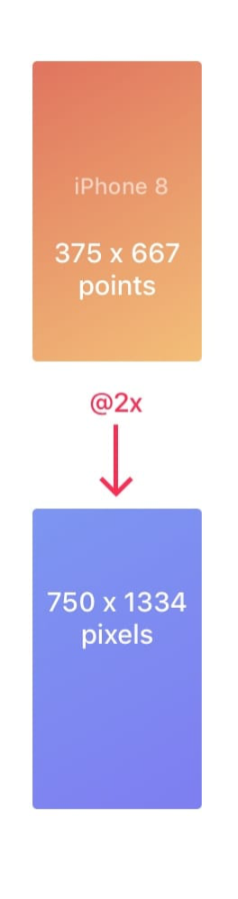
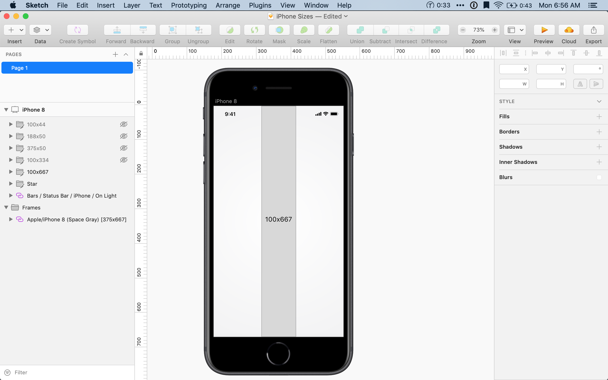
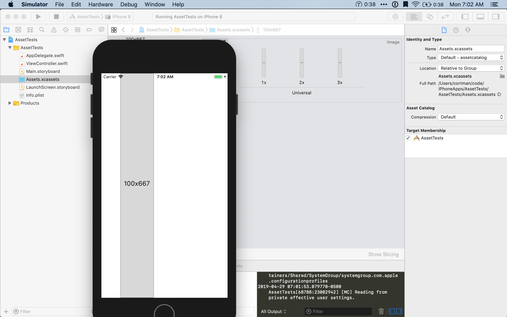
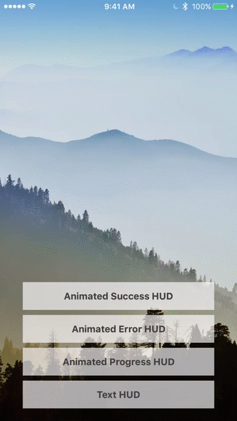
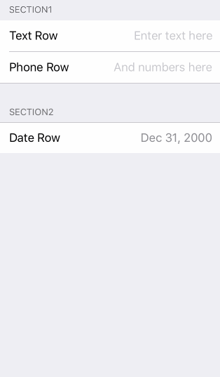
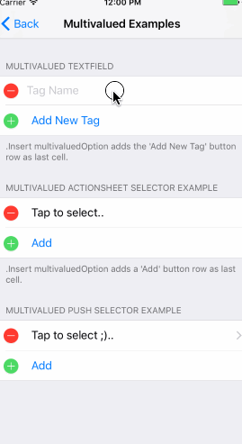

# 10 Essentials in my Mobile Development Toolbox

## Background / Philosophy
- I’m going to assume that you have never attempted to create a mobile app before. 
- we’re going to build a mobile app for iOS first, then android
- bias against non-native solutions.
- ReactNative,NativeScript, Xamarin, RubyMotion all address feedback loop and / or code sharing problems. I don’t think you should use them without knowing the platform. I think it was easier to make a case against learning obj-c, but less against swift. You don’t need to be a language expert to be productive in the language. You’re going to have to google and become familiar with the platform libraries (date manipulation) anyway other wise you won’t look like and _iPhone app_
- some things might be dated, but still good enough
## Challenges
- Feedback loop is slower
- Different / unfamiliar (not intuitive)
- Missing tools, up front investment
- 
## Minimal Design Up Front (Sketch) 
*Mention possibly more modern alternative (Framer?)*
- Why and when do I do this?
### Paper Sketches
Paper sketches can be extremely helpful to figure out what data elements you are going to need and how many screens  you will need. If the work is going to be split between an app and backend developer(s) then this will give them backend folks enough of an idea of what they need to build.


### Sketch
Sketch is a vector based graphics tool. Maybe similar to adobe illustrator, but more focused.
If you need a more high fidelity prototype sketch is a good tool.  Reasons you might do this could be that you need to pitch the app first in order to acquire funding or generate excitement. Or, if you know that unique / branded design will be an important factor in your success then there will be some design assets that you need to create anyway, so this is one way you could do that.

This is also a much faster way to work out how big you want to make some things.
On iOS your measurement unit is a point. When dealing with non-retina screens 1 point == 1 pixel. On retina 1 point == 2 pixels, and the plus phones 1 point == 3 pixels. So in sketch it is easiest to design at 1X.  Apple distributes  the [Apple iOS UI Sketch Library](https://developer.apple.com/design/resources/#ios-apps) ([https://developer.apple.com/design/resources/#ios-apps](https://developer.apple.com/design/resources/#ios-apps))  to give you some existing styles to work with.

For example, the iPhone 8 is 750 x 1334 pixels. But when we make the screen in sketch we will set it to be 375x667 pixels which is what iOS would call it in points.
Now we make a 100x667 rectangle in sketch. When we export it @2x it will be 200x1334 pixels tall. In sketch it will look like it is the whole length of the screen and on the phone it will be too.

  


### Sip
Another thing you’re going to have to do is color things. Even if you are planning to start with the default iOS color scheme it can be very helpful to have those colors handy and to be able to convert them to various formats (HEX, RGB, UIColor etc)
Sip is a great little tool that lives up in your menu bar. It features a color picker so that you can lift colors out of other apps & web pages you might find and then lets you keep them 
### IconJar

Icons are important. They allow you to communicate to the user with less space than text, and they also give your app a more professional and polished look.
I use IconJar to keep all the different icon libraries I’ve used organized and searchable.
It also allows me to export the icons in several different formats. 
You can see after I export to Sketch, it has kept it as a vector because I told it to export as PDF.
You can find a great list of starter icon libraries at [https://github.com/pluwen/awesome-iconjar](https://github.com/pluwen/awesome-iconjar)

** Both IconJar and Sip are available as part of SetApp**
### Asset Catalog Creator Pro
I primarily use for creating App Icons. Because you need so many different sizes. It’s great to just drop your image in and have it do that work for you.

## Creating an App
### Xcode
#### New Project
While not strictly required, it is easier if you set up your Apple Developer program membership _first_ if you are creating a thing you want to put in the store. 

When you open up Xcode it will ask if you want to start a playground, new project or open an existing. Playgrounds are a neat way to explore the swift language.


For 99% of my applications I pick Single View App. I think it’s easy to look at this screen and think I have to decide right now if I want to use tab or page based navigation? But don’t worry, you can add that stuff all later, Xcode is offering to do some of that up front. One of the reasons I prefer the Single View App is _because_ I have less generated code that I’m not sure if I can delete later.


The first thing we need to do is pick our team on this screen. Your _team_ is picking which entity within the Apple Developer Program you will be publishing this app on behalf of. We’ll get into some of the details of this later, for now pick the team that is associated with the $99 registration fee you paid. Xcode also provides a "Personal Team" that will let you put an app on your own device but not put in the store.
Once you have a team you can pick a name and organization identifier. Your **organizationIdentifier.name** is the _bundle identifier_ for your app and they have to be unique and sometimes show up. Best practice is to use the old reverse domain name for your organization and a descriptive name. I always opt to have Xcode add the testing targets for me, and rarely use _Core Data_

#### Targets
Within Xcode  you will have 3 targets. App, UnitTest, and UITest (if you checked the boxes as I did). Targets are compiler settings for a specific destination, so if you needed to have an Xcode project compile for the raspberry pi, you might need to add a new target. 

Generally I do very little messing around in here. The setting I most frequently need to look & change is the _Swift Language Version_ and the need for that has been decreasing now that they are maintaining binary compatibility between releases. When that wasn’t the case you might have to go in and see if you were using version 3 or version 3.2 and reconcile differences with libraries.


One other thing I want to point out here is that if this is your very first time making an app, or you have a new phone Xcode (really Apple) might not know you can load apps on to your phone. That’s what it’s telling me here. The _Fix_ button will register your device so that you can put code on it.


This used to be a really dangerous thing, but since Xcode 9 Apple has reworked a lot of the stuff behind the scenes and this has been pretty safe.

### Swift
- Playgrounds
- Syntax

###  Interface builder
I’m sure there’s plenty of opinions about using a tool to drag and drop pieces of UI together.  When I used to spend a lot of time in Visual Studio, I found the WebForms and often Xaml designer to be unusable. The WinForms designer was good and really the (only) way to do forms. I did eventually have a project where I focused a lot on the visual design aspects and in that instance I used Expression Blend and was happy with the results. The general problem though is that code generated from tools can be very painful to read and manage for a human. In a team environment it can also be a source of merge conflicts that are impossible to resolve. The same caveats apply to storyboards / interface builder.  If you have several programmers working on the project you need to partition the code or prototype in IB and then manually create the views.
#### Previewing Resolutions
One of the strengths of IB that has become more important the past few years though is its ability to let you preview the design on multiple resolutions.
Because there are so many more screen sizes for Apple’s devices you have to view your design on each one and that takes time to plug them in (if you have physical devices) or start the simulator. In interface builder you can preview the design very quickly though.


#### Static Table View Controller

Table View Controllers are something you will use a lot of. They are great for showing lists of data and lists of _fields_. They also give you scrolling and keyboard handling behaviors for free.
I tend to start with a Table View Controller and then adjust when I start to feel like I am fighting against it or it isn’t working for me.
When you need to display some data or build a menu navigation system _static_ table view controllers are great. They eliminate a lot of very repetitive programming that you would otherwise have to do.
**VIDEO**

#### Connecting the Designer to Code

##### Navigation Controller
Navigation and TabBar are the 2 most common navigation primitives. I felt the tab bar controller was really straight forward to understand, but the navigation controller took me a little longer. I think part of this might be because you generally have a single tab bar at the beginning of your app and it stays pretty fixed whereas navigation controllers might be nested to accommodate certain flows. I wouldn’t nest navigation controllers if you can avoid it, but it’s ok if they aren’t declared in the top most screens of your app.
We can add a navigation controller to the storyboard directly, or we can embed an existing controller inside one. Once that’s done we can ctrl+click and drag to connect parts of our table view with other screens. Interface Builder understands that when we click and drag from a UITableViewCell to another controller we wen to navigate there. The _thing_ that encapsulates the navigation is called a _segue_. Embedding our controller inside a navigation controller also added a navigation item. This is what we use to set a title or add buttons to the navigation bar
**VIDEO**
##### Actions & Outlets
One of the more unintuitive things about Interface Builder is how we connect things on the screen to things in our code. When we do this, variables that refer to controls (buttons, labels, text boxes , etc) are called _outlets_. Functions tied to events are called _actions_
First we need to get a class to hold these things and then open it in the assistant editor. Then we ctrl+click and drag from Interface Builder to the code.
Sometimes as we change our code these links can get out of sync. When that happens you need to go into the outlet inspector and remove them.
**VIDEO**

##### Passing Data

### Cocoapods

Cocoapods is my dependency tool of choice for installing libraries. 
There’s 3 options
1. Cocoapods
2. Carthage
3. Swift Package Manager

I think eventually Swift Package Manager will be the thing but not every library supports it yet. 
One of the things I really like about cocoa pods is that it gives me some tools for controlling build settings of the libraries (swift language version sometimes needs to be overridden) and it also handles some of the hooking up of targets in Xcode for you. I expect if you really know Xcode and want to bend it to your will you might like Carthage better. The biggest downside to Cocoapods is that it requires  ruby and if you don’t already have it setup it’s just one more thing. But, you’ll need ruby anyway if you decide to automate your build using _fastlane_ as I do.

In my project folder:
```bash
bundle init
echo 'gem "cocoapods"' >> Gemfile
bundle install
bundle exec pod init
```

**Once you start using Cocoapods you have to open the .xcworkspace file it generates instead of the .xcproj file in Xcode**

#### Podfile

```ruby
# Uncomment the next line to define a global platform for your project
# platform :ios, '9.0'

target 'EntrefestDemo' do
  # Comment the next line if you're not using Swift and don't want to use dynamic frameworks
  use_frameworks!

  # Pods for EntrefestDemo
  pod 'SomeAwesomePod', '~> 4.0'

  target 'EntrefestDemoTests' do
    inherit! :search_paths
    # Pods for testing
  end

  target 'EntrefestDemoUITests' do
    inherit! :search_paths
    # Pods for testing
  end

end

```

I added the _SomeAwesomePod_ line so you can see what it looks like.
I tend to pick pods that give me familiar API’s to what I am used to in other environments and ones that have some sort of parallel between iOS & Android if possible.

#### PKHud
I use this in my projects to give me a decent way to throw up a busy indicator or a success message. This let’s me avoid _Alerts_ which are a bit obtrusive and require more ceremony than I like for the task. Most often used so I can say 'Busy' while I’m sending  something to the server and 'Success' when it works (unless it’s a node backend then maybe 50/50 chance 🤣)


[https://github.com/pkluz/PKHUD](https://github.com/pkluz/PKHUD)

#### Eureka
I love Eureka. When you need to do some forms & CRUD screens it can save you a ton of effort. Eureka is a DSL that you can use to programmatically create table based forms

```swift
import Eureka

class MyFormViewController: FormViewController {

    override func viewDidLoad() {
        super.viewDidLoad()
        form +++ Section("Section1")
            <<< TextRow(){ row in
                row.title = "Text Row"
                row.placeholder = "Enter text here"
            }
            <<< PhoneRow(){
                $0.title = "Phone Row"
                $0.placeholder = "And numbers here"
            }
        +++ Section("Section2")
            <<< DateRow(){
                $0.title = "Date Row"
                $0.value = Date(timeIntervalSinceReferenceDate: 0)
            }
    }
}
```

[https://github.com/xmartlabs/Eureka](https://github.com/xmartlabs/Eureka)

#### Alamofire
Alamofire is a more familiar HTTP client library. The default iOS `NSURLSession` definitely shows its Objective-C roots. Alamofire is made for swift though.

```swift
Alamofire.request("https://httpbin.org/get").responseJSON { response in
    print("Request: \(String(describing: response.request))")   // original url request
    print("Response: \(String(describing: response.response))") // http url response
    print("Result: \(response.result)")                         // response serialization result

    if let json = response.result.value {
        print("JSON: \(json)") // serialized json response
    }

    if let data = response.data, let utf8Text = String(data: data, encoding: .utf8) {
        print("Data: \(utf8Text)") // original server data as UTF8 string
    }
}
```

[https://github.com/Alamofire/Alamofire](https://github.com/Alamofire/Alamofire)

**Note: They appear to be undergoing some API changes for their version 5 release. This example might be out of date**

#### SwiftyJSON

There is platform support but like alamofire, the Objective-C heritage is evident and so the code can get clunky. This is a higher level swift API
```swift
let json = JSON(data: dataFromNetworking)
let result = json[999999]["wrong_key"]["wrong_name"]
if let userName = result.string {
    //Calm down, take it easy, the ".string" property still produces the correct Optional String type with safety
} else {
    //Print the error
    print(result.error)
}
```

[https://github.com/SwiftyJSON/SwiftyJSON](https://github.com/SwiftyJSON/SwiftyJSON)


#### Realm

Realm is my go to data storage solution. iOS and Android both offer some sort of preferences / keychain API and you should use those for simple values. But eventually you will probably need more than that. 
A common pattern for me is to store a UserID in the iOS keychain and then use that to look up a row in Realm.
Realm offers an great performance but doesn’t make you work very hard for it and also supports notifications so you can make your UI react to changes to the underlying store. When you need it they offer a nice cloud or self hosted option to have a sync server.
I should say that I think they might still be experimenting with revenue models. Their prices are fair, but hard to say if they may or may not change in the future. Google Firebase and AWS AppSync are also good choices. The thing that causes me to default to Realm still is that I often want local only storage and AWS & Google both want your data. I often implement my own mechanism to send data to & from a server when I need it. (GUID Id’s are your friend)
```swift
// Define your models like regular Swift classes
class Dog: Object {
    @objc dynamic var name = ""
    @objc dynamic var age = 0
}
class Person: Object {
    @objc dynamic var name = ""
    @objc dynamic var picture: Data? = nil // optionals supported
    let dogs = List<Dog>()
}

// Use them like regular Swift objects
let myDog = Dog()
myDog.name = "Rex"
myDog.age = 1
print("name of dog: \(myDog.name)")

// Get the default Realm
let realm = try! Realm()

// Query Realm for all dogs less than 2 years old
let puppies = realm.objects(Dog.self).filter("age < 2")
puppies.count // => 0 because no dogs have been added to the Realm yet

// Persist your data easily
try! realm.write {
    realm.add(myDog)
}

// Queries are updated in realtime
puppies.count // => 1

// Query and update from any thread
DispatchQueue(label: "background").async {
    autoreleasepool {
        let realm = try! Realm()
        let theDog = realm.objects(Dog.self).filter("age == 1").first
        try! realm.write {
            theDog!.age = 3
        }
    }
}

```

[https://realm.io](https://realm.io)
#### Honorable Mention
- Charting: Charts [https://github.com/danielgindi/Charts](https://github.com/danielgindi/Charts)
- Maps: Mapbox [https://www.mapbox.com](https://www.mapbox.com)
- Weather: AerisWeather [https://www.aerisweather.com](https://www.aerisweather.com)
- Testing: Quick & Nimble [https://github.com/Quick/Quick](https://github.com/Quick/Quick) [https://github.com/Quick/Nimble](https://github.com/Quick/Nimble)
- 

##  Distribution 

### Developer Portal  & TestFlight
Now it’s time to get our app into the hands of some users.
I use TestFlight for my beta deployments. There are other options but I haven’t had a strong reason to not use TestFlight yet. I also like that it allows me to take a build I have in TestFlight and assign it to the  AppStore. I don’t have to rebuild or upload another copy. When you first submit to TestFlight the app goes through Beta App Review which let’s the later final AppStore review be faster.
I think the biggest gotcha when it comes to distribution is signing.
Apple has these provisioning profiles. A provisioning profile is a combination of signing certificate, device id and app id (possibly wild carded). The provisioning profile is the thing that iOS consults to decide if this app can be installed
1. Is the app id of the app in this provisioning profile?
2. Is the device I’m installing on in the list of devices in the provisioning profile?
3. Was the app signed by the same certificate as the provisioning profile
Mostly Xcode has gotten good about managing this and I haven’t had to mess with it in a while. But if you are a large org and you need to control which developers can install which apps you might need to manage some of this by hand.
Otherwise let Xcode do it.

What you do have to take a little care of is those signing certificates. In order for the app to go into TestFlight or the AppStore it has to be signed by the _private key_ of one of your distribution certificates. You can only have 2-3 of these at any one time. So if you have multiple developers and any of them will be able to build and upload to the store you need to manually save and distribute that private key. Apple _does not_ store the private keys. You can get the key out of your keychain or save the file some place safe when you generate the certificate in the Apple Developer Portal


[https://developer.apple.com](https://developer.apple.com)

Manual TestFlight instructions [https://www.raywenderlich.com/5352-testflight-tutorial-ios-beta-testing](https://www.raywenderlich.com/5352-testflight-tutorial-ios-beta-testing "Manual TestFlight Instructions")

### Fastlane

Once you’ve got your certificates set up, it’s time to automate this process. Running builds and uploading archives can be a time consuming process. 

Fastlane is a set of ruby programs that can automate all the steps of iOS and Android build and deployment.
[https://fastlane.tools](https://fastlane.tools)

```bash
echo 'gem "fastlane"' >> Gemfile
bundle install
bundle exec fastlane init
#Im choosing option 2 for this demo
```


This is going to sign you into the developer portal and ask you some questions about your app. For the most part you can take the defaults. It will prompt you for names of the app twice, I always put the same (and it matches the display name in Xcode)


When it’s done you will have a `fastlane/Fastfile` file
```ruby
# This file contains the fastlane.tools configuration
# You can find the documentation at https://docs.fastlane.tools
#
# For a list of all available actions, check out
#
#     https://docs.fastlane.tools/actions
#
# For a list of all available plugins, check out
#
#     https://docs.fastlane.tools/plugins/available-plugins
#

# Uncomment the line if you want fastlane to automatically update itself
# update_fastlane

default_platform(:ios)

platform :ios do
  desc "Push a new beta build to TestFlight"
  lane :beta do
    build_app(workspace: "EntrefestDemo.xcworkspace", scheme: "EntrefestDemo")
    upload_to_testflight
  end
end

```
And if you run `bundle exec fastlane beta` it will build and upload your app to TestFlight

You can also add things in here to automatically create git tags, take screen shots or upload app metadata to the store.